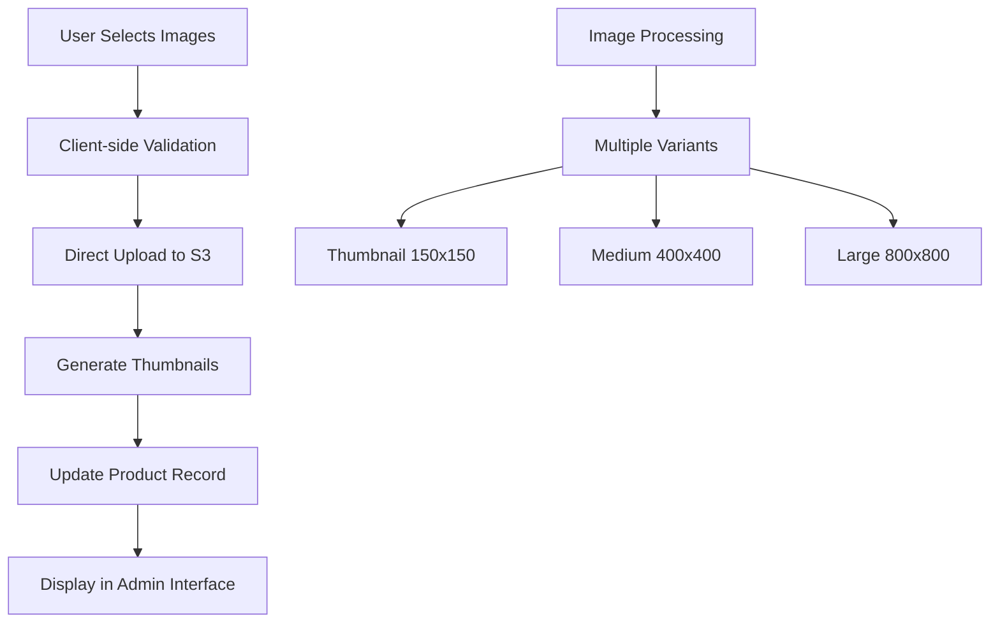

# Brooke Maisy Admin Interface Architecture
## Phase 3: Complete Product Management System

### Executive Summary

This document outlines the comprehensive architecture for the Brooke Maisy Rails 8 crafts store admin interface. The design leverages the existing solid foundation of 10 fully configured models, Devise authentication with role-based access, and the beautiful ivory/pastel Tailwind theme to create a powerful, intuitive admin system.

### Current Foundation Analysis

**Strengths:**
- ✅ Rails 8 with modern architecture (Solid Cache, Solid Queue, Solid Cable)
- ✅ Complete data model with 10 entities and proper relationships
- ✅ Devise authentication with admin/customer roles via [`User`](app/models/user.rb:9) enum
- ✅ CanCanCan gem available for authorization
- ✅ AWS S3 configured for production image storage
- ✅ Beautiful ivory/pastel Tailwind theme with responsive design
- ✅ Active Storage configured with image processing capabilities
- ✅ Comprehensive product system with variants, categories, and inventory tracking

**Current Gaps:**
- ❌ No admin controllers, views, or routes exist
- ❌ CanCanCan abilities not configured
- ❌ No admin-specific layouts or navigation
- ❌ No product management interfaces
- ❌ No image upload workflows

---

## 1. Admin Namespace Route Structure

### 1.1 Route Organization

```ruby
# config/routes.rb
Rails.application.routes.draw do
  # Existing routes...
  devise_for :users, controllers: {
    omniauth_callbacks: "users/omniauth_callbacks"
  }
  
  root "home#index"
  
  # Admin namespace - protected by authentication and authorization
  namespace :admin do
    # Admin dashboard
    root "dashboard#index"
    
    # Core admin resources
    get "dashboard", to: "dashboard#index"
    get "analytics", to: "dashboard#analytics"
    get "settings", to: "settings#index"
    
    # Product Management
    resources :products do
      member do
        patch :toggle_active
        patch :toggle_featured
        post :duplicate
      end
      
      collection do
        get :bulk_edit
        patch :bulk_update
        delete :bulk_destroy
        get :export
        post :import
      end
      
      # Nested image management
      resources :images, only: [:create, :update, :destroy] do
        member do
          patch :set_primary
          patch :reorder
        end
      end
    end
    
    # Product Variants (nested under products)
    resources :products do
      resources :variants, controller: 'product_variants' do
        member do
          patch :toggle_active
        end
      end
    end
    
    # Category Management
    resources :categories do
      member do
        patch :toggle_active
        patch :move_up
        patch :move_down
      end
      
      collection do
        post :reorder
      end
    end
    
    # Order Management
    resources :orders, only: [:index, :show, :update] do
      member do
        patch :update_status
        patch :update_payment_status
        post :send_tracking_email
        get :print_invoice
      end
      
      collection do
        get :export
      end
    end
    
    # Customer Management
    resources :customers, controller: 'users' do
      member do
        patch :toggle_role
      end
    end
    
    # Review Management
    resources :reviews, only: [:index, :show, :update, :destroy] do
      member do
        patch :approve
        patch :reject
      end
      
      collection do
        get :pending
        get :approved
        get :rejected
      end
    end
    
    # Content Management
    resources :articles do
      member do
        patch :toggle_published
        patch :toggle_featured
      end
    end
    
    # System Management
    resources :admin_users, only: [:index, :show, :new, :create, :destroy]
    
    # API endpoints for AJAX operations
    namespace :api do
      resources :products, only: [] do
        collection do
          get :search
          get :low_stock
        end
      end
      
      resources :orders, only: [] do
        collection do
          get :recent
          get :stats
        end
      end
    end
  end
  
  # Existing public routes...
end
```

### 1.2 Route Security Strategy

**Authentication Requirements:**
- All `/admin/*` routes require user authentication
- All admin routes require `admin` role via CanCanCan abilities
- API endpoints use token-based authentication for AJAX calls

**Route Constraints:**
```ruby
# Add to routes.rb
constraints lambda { |request| 
  user = request.env['warden']&.user
  user&.admin?
} do
  namespace :admin do
    # Admin routes here
  end
end
```

---

## 2. Controller Hierarchy Architecture

### 2.1 Base Admin Controller

```ruby
# app/controllers/admin/base_controller.rb
class Admin::BaseController < ApplicationController
  before_action :authenticate_user!
  before_action :ensure_admin!
  before_action :set_admin_layout
  
  layout 'admin/application'
  
  protected
  
  def ensure_admin!
    redirect_to root_path, alert: 'Access denied.' unless current_user&.admin?
  end
  
  def set_admin_layout
    @admin_layout = true
  end
  
  # Common admin helper methods
  def set_page_title(title)
    @page_title = title
  end
  
  def set_breadcrumbs(*crumbs)
    @breadcrumbs = crumbs
  end
  
  def handle_admin_error(exception)
    Rails.logger.error "Admin Error: #{exception.message}"
    redirect_to admin_root_path, alert: 'An error occurred. Please try again.'
  end
end
```

### 2.2 Controller Responsibilities

**Dashboard Controller** (`Admin::DashboardController`)
- System overview and key metrics
- Quick actions and shortcuts
- Recent activity feed
- Performance analytics

**Products Controller** (`Admin::ProductsController`)
- Full CRUD operations for products
- Bulk operations (edit, delete, export)
- Image management integration
- Inventory tracking
- SEO optimization tools

**Categories Controller** (`Admin::CategoriesController`)
- Category CRUD with position management
- Drag-and-drop reordering
- Bulk operations
- Category analytics

**Orders Controller** (`Admin::OrdersController`)
- Order listing with advanced filtering
- Order status management
- Payment status tracking
- Invoice generation
- Customer communication

**Users Controller** (`Admin::UsersController`)
- Customer management
- Role assignment
- User analytics
- Communication tools

**Reviews Controller** (`Admin::ReviewsController`)
- Review moderation workflow
- Bulk approval/rejection
- Review analytics
- Customer feedback management

---

## 3. CanCanCan Authorization Architecture

### 3.1 Ability System Design

```ruby
# app/models/ability.rb
class Ability
  include CanCan::Ability

  def initialize(user)
    user ||= User.new # Guest user
    
    if user.admin?
      admin_abilities(user)
    else
      customer_abilities(user)
    end
  end

  private

  def admin_abilities(user)
    # Full admin access
    can :manage, :all
    
    # Admin dashboard access
    can :access, :admin_panel
    can :read, :admin_dashboard
    can :read, :admin_analytics
    
    # Product management
    can :manage, Product
    can :manage, ProductVariant
    can :manage, Category
    can [:bulk_edit, :bulk_update, :bulk_destroy, :export, :import], Product
    
    # Order management
    can :read, Order
    can :update, Order
    can [:update_status, :update_payment_status], Order
    
    # Customer management
    can :read, User
    can :update, User, role: 'customer' # Can't modify other admins
    
    # Review management
    can :manage, Review
    can [:approve, :reject], Review
    
    # Content management
    can :manage, Article
    
    # System management
    can :read, User, role: 'admin'
    can :create, User # Can create new admin users
    cannot :destroy, User, id: user.id # Can't delete self
  end

  def customer_abilities(user)
    # Customer-specific abilities
    can :read, Product, active: true
    can :read, Category, active: true
    can :read, Article, published: true
    
    # Own data management
    can :manage, Order, user: user
    can :manage, Review, user: user
    can :manage, Cart, user: user
    can :update, User, id: user.id
  end
end
```

### 3.2 Controller Authorization Integration

```ruby
# In each admin controller
class Admin::ProductsController < Admin::BaseController
  load_and_authorize_resource
  
  def index
    @products = @products.includes(:category, :product_variants, images_attachments: :blob)
                        .page(params[:page])
                        .per(25)
  end
  
  # Additional controller logic...
end
```

### 3.3 View Authorization Helpers

```ruby
# app/helpers/admin_helper.rb
module AdminHelper
  def admin_can?(action, resource)
    can?(action, resource)
  end
  
  def admin_link_if_authorized(name, path, resource, action = :read, options = {})
    if can?(action, resource)
      link_to name, path, options
    else
      content_tag :span, name, class: 'text-gray-400'
    end
  end
end
```

---

## 4. Product Management System Architecture

### 4.1 Product CRUD Interface Design

**Product Listing Features:**
- Advanced filtering (category, status, stock level, price range)
- Bulk operations (activate/deactivate, delete, export)
- Quick edit inline capabilities
- Image thumbnails with hover preview
- Stock level indicators with color coding
- Search functionality with autocomplete

**Product Form Architecture:**
```ruby
# Product form sections
1. Basic Information
   - Name, Description, SKU
   - Category selection
   - Price and weight
   - Status toggles (active, featured)

2. Inventory Management
   - Stock quantity
   - Low stock threshold alerts
   - Inventory tracking options

3. Product Details
   - Materials, dimensions
   - Care instructions
   - SEO metadata

4. Image Management
   - Drag-and-drop upload
   - Image reordering
   - Alt text management
   - Primary image selection

5. Variants Management
   - Color, size, style options
   - Variant-specific pricing
   - Variant inventory tracking
```

### 4.2 Category Management System

**Hierarchical Organization:**
- Drag-and-drop position management
- Bulk category operations
- Category analytics and product counts
- SEO-friendly slug management

**Category Features:**
- Active/inactive status
- Position-based ordering
- Product count tracking
- Category-specific settings

### 4.3 Inventory Tracking Architecture

**Stock Management Features:**
- Real-time inventory updates
- Low stock alerts and notifications
- Inventory history tracking
- Bulk inventory adjustments

**Stock Level Indicators:**
```ruby
# Stock status helper
def stock_status_class(product)
  case
  when product.out_of_stock?
    'bg-red-100 text-red-800'
  when product.low_stock?
    'bg-yellow-100 text-yellow-800'
  else
    'bg-green-100 text-green-800'
  end
end
```

---

## 5. AWS S3 Image Upload Architecture

### 5.1 Image Upload Workflow



### 5.2 Image Processing Pipeline

**Active Storage Configuration:**
```ruby
# config/storage.yml (already configured)
amazon:
  service: S3
  access_key_id: <%= Rails.application.credentials.dig(:aws, :access_key_id) %>
  secret_access_key: <%= Rails.application.credentials.dig(:aws, :secret_access_key) %>
  region: us-east-1
  bucket: brooke-maisy-<%= Rails.env %>
  public: true
```

**Image Variant Processing:**
```ruby
# In Product model (enhancement)
class Product < ApplicationRecord
  has_many_attached :images do |attachable|
    attachable.variant :thumbnail, resize_to_limit: [150, 150]
    attachable.variant :medium, resize_to_limit: [400, 400]
    attachable.variant :large, resize_to_limit: [800, 800]
  end
  
  def primary_image
    images.attached? ? images.first : nil
  end
  
  def image_variants(size = :medium)
    images.map { |image| image.variant(size) }
  end
end
```

### 5.3 Drag-and-Drop Upload Interface

**JavaScript Controller:**
```javascript
// app/javascript/controllers/image_upload_controller.js
import { Controller } from "@hotwired/stimulus"

export default class extends Controller {
  static targets = ["dropzone", "preview", "input"]
  
  connect() {
    this.setupDropzone()
  }
  
  setupDropzone() {
    // Drag and drop implementation
    // Direct S3 upload with progress tracking
    // Image preview generation
    // Error handling and validation
  }
}
```

---

## 6. Admin Dashboard Design

### 6.1 Dashboard Layout Architecture

**Main Dashboard Sections:**
1. **Key Metrics Cards**
   - Total products, orders, customers
   - Revenue metrics
   - Inventory alerts

2. **Quick Actions Panel**
   - Add new product
   - Process orders
   - Manage inventory

3. **Recent Activity Feed**
   - New orders
   - Low stock alerts
   - Customer reviews

4. **Analytics Charts**
   - Sales trends
   - Popular products
   - Customer growth

### 6.2 Navigation Structure

**Primary Navigation:**
```
├── Dashboard
├── Products
│   ├── All Products
│   ├── Categories
│   ├── Add Product
│   └── Bulk Import
├── Orders
│   ├── All Orders
│   ├── Pending
│   ├── Processing
│   └── Completed
├── Customers
├── Reviews
├── Content
│   └── Blog Articles
└── Settings
```

**Secondary Navigation:**
- User profile dropdown
- Quick search
- Notifications
- System status

---

## 7. Database Optimization Strategies

### 7.1 Performance Indexes

**Additional Indexes Needed:**
```ruby
# Migration for admin performance
class AddAdminIndexes < ActiveRecord::Migration[8.0]
  def change
    # Product search optimization
    add_index :products, [:active, :featured]
    add_index :products, [:category_id, :active]
    add_index :products, :created_at
    
    # Order management optimization
    add_index :orders, [:status, :created_at]
    add_index :orders, [:payment_status, :created_at]
    
    # Review management optimization
    add_index :reviews, [:approved, :created_at]
    
    # User management optimization
    add_index :users, [:role, :created_at]
  end
end
```

### 7.2 Query Optimization

**Efficient Loading Patterns:**
```ruby
# Optimized product loading for admin
def admin_products_scope
  Product.includes(
    :category,
    :product_variants,
    :reviews,
    images_attachments: :blob
  ).left_joins(:product_variants)
   .select('products.*, COUNT(product_variants.id) as variants_count')
   .group('products.id')
end
```

---

## 8. UI/UX Wireframe Specifications

### 8.1 Admin Layout Structure

**Layout Hierarchy:**
```
┌─────────────────────────────────────────┐
│ Admin Header (Logo, Search, User Menu)  │
├─────────────────────────────────────────┤
│ Sidebar Nav │ Main Content Area         │
│             │                           │
│ - Dashboard │ ┌─────────────────────┐   │
│ - Products  │ │ Page Header         │   │
│ - Orders    │ │ (Title, Actions)    │   │
│ - Customers │ ├─────────────────────┤   │
│ - Reviews   │ │                     │   │
│ - Content   │ │ Content Area        │   │
│ - Settings  │ │                     │   │
│             │ │                     │   │
│             │ └─────────────────────┘   │
└─────────────────────────────────────────┘
```

### 8.2 Key Interface Wireframes

**Product Management Interface:**
- Grid/list view toggle
- Advanced filtering sidebar
- Bulk action toolbar
- Quick edit modals
- Image gallery with drag-and-drop

**Order Management Interface:**
- Status-based filtering
- Order timeline view
- Customer information panel
- Payment status indicators
- Action buttons (print, email, update)

**Dashboard Interface:**
- Metric cards with trend indicators
- Interactive charts
- Recent activity timeline
- Quick action buttons
- Alert notifications

---

## 9. Technical Implementation Roadmap

### Phase 1: Foundation (Week 1-2)
1. **Setup Admin Namespace**
   - Create admin route structure
   - Implement base admin controller
   - Setup admin layout and navigation

2. **Configure Authorization**
   - Implement CanCanCan abilities
   - Add authorization to controllers
   - Create admin middleware

3. **Basic Dashboard**
   - Create dashboard controller and views
   - Implement basic metrics
   - Setup admin navigation

### Phase 2: Product Management (Week 3-4)
1. **Product CRUD Interface**
   - Products controller with full CRUD
   - Product form with validation
   - Product listing with filtering

2. **Category Management**
   - Categories CRUD interface
   - Position management
   - Category analytics

3. **Image Upload System**
   - AWS S3 direct upload
   - Image processing pipeline
   - Drag-and-drop interface

### Phase 3: Advanced Features (Week 5-6)
1. **Order Management**
   - Order listing and filtering
   - Status management
   - Customer communication

2. **Bulk Operations**
   - Product bulk edit/delete
   - Import/export functionality
   - Batch processing

3. **Analytics and Reporting**
   - Dashboard analytics
   - Performance metrics
   - Export capabilities

### Phase 4: Polish and Optimization (Week 7-8)
1. **UI/UX Refinement**
   - Responsive design optimization
   - Accessibility improvements
   - User experience testing

2. **Performance Optimization**
   - Database query optimization
   - Caching implementation
   - Image optimization

3. **Testing and Documentation**
   - Comprehensive test coverage
   - Admin user documentation
   - Deployment preparation

---

## 10. Security Considerations

### 10.1 Authentication Security
- Multi-factor authentication for admin users
- Session timeout management
- IP-based access restrictions
- Audit logging for admin actions

### 10.2 Authorization Security
- Role-based access control
- Resource-level permissions
- Action-specific authorization
- Cross-site request forgery protection

### 10.3 Data Security
- Input validation and sanitization
- SQL injection prevention
- File upload security
- Secure image processing

---

## 11. Monitoring and Maintenance

### 11.1 Admin Activity Logging
```ruby
# Admin action logging
class AdminActionLogger
  def self.log_action(user, action, resource, details = {})
    Rails.logger.info({
      admin_user: user.email,
      action: action,
      resource: resource.class.name,
      resource_id: resource.id,
      timestamp: Time.current,
      details: details
    }.to_json)
  end
end
```

### 11.2 Performance Monitoring
- Database query performance tracking
- Image upload success rates
- Admin interface response times
- Error rate monitoring

---

## Conclusion

This architecture provides a comprehensive foundation for building a powerful, scalable admin interface for the Brooke Maisy crafts store. The design leverages Rails 8's modern capabilities, maintains consistency with the existing beautiful theme, and provides all necessary functionality for effective product and order management.

The modular approach allows for incremental implementation while maintaining system stability and user experience quality throughout the development process.