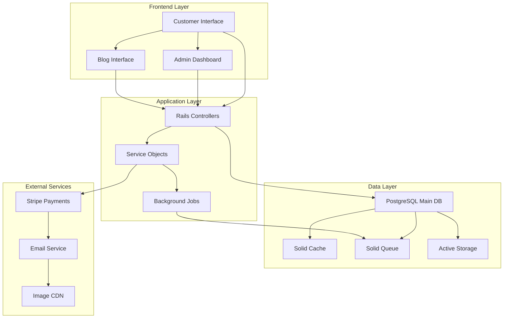
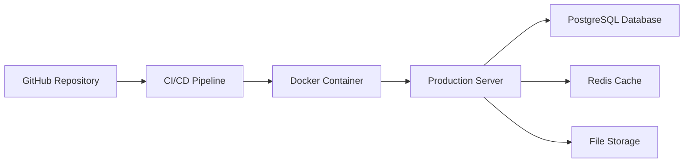

# Brooke Maisy - Architecture Overview

## System Architecture



## Component Structure

```
app/views/
├── components/
│   ├── ui/
│   │   ├── _button.html.erb
│   │   ├── _card.html.erb
│   │   ├── _modal.html.erb
│   │   └── _form_field.html.erb
│   ├── product/
│   │   ├── _card.html.erb
│   │   ├── _gallery.html.erb
│   │   └── _variant_selector.html.erb
│   ├── cart/
│   │   ├── _item.html.erb
│   │   ├── _summary.html.erb
│   │   └── _checkout_form.html.erb
│   └── admin/
│       ├── _sidebar.html.erb
│       ├── _metric_card.html.erb
│       └── _data_table.html.erb
```

## Key Features by Phase

### Phase 1: Foundation
- Custom Tailwind theme with ivory/pastel colors
- Authentication with Devise
- Admin role system
- Base layout with navigation

### Phase 2: Data Models
- Product catalog with variants
- Order management system
- Blog content system
- User management with roles

### Phase 3-4: Core Store
- Product management interface
- Customer-facing catalog
- Shopping cart with Turbo Frames
- Image upload system

### Phase 5: E-commerce
- Stripe payment integration
- Order processing workflow
- Email notifications
- Customer accounts

### Phase 6: Blog & Community
- Article management system
- Comment system
- Content publishing workflow
- SEO optimization

### Phase 7: Analytics Dashboard
- Sales metrics tracking
- Customer behavior analytics
- Inventory management
- Content performance metrics

## Technology Decisions

### Authentication: Devise
- Mature, well-tested solution
- Easy admin role implementation
- Good integration with Rails

### Payments: Stripe
- Excellent Rails integration
- Handles PCI compliance
- Good for small business needs

### File Storage: Active Storage
- Built into Rails
- Easy image processing
- Can scale to cloud storage later

### Background Jobs: Solid Queue
- Already configured in Rails 8
- PostgreSQL-based
- Simple deployment

### Styling: Tailwind CSS
- Rapid development
- Easy customization
- Good component patterns

## Security Considerations

- CSRF protection enabled
- Strong parameters for all forms
- Admin-only routes protected
- File upload validation
- SQL injection prevention via ActiveRecord
- XSS protection with Rails helpers

## Performance Strategy

- Database indexing on key lookup fields
- Image optimization and lazy loading
- Turbo Frames for dynamic content
- Caching for product catalog
- Background job processing for emails

## Deployment Architecture



## Future Extensibility

### Photo Booking System
- Service model extending Product
- Calendar integration
- Booking workflow
- Client gallery system

### Advanced Features
- Multi-vendor support
- Subscription products
- Advanced analytics
- Mobile app API